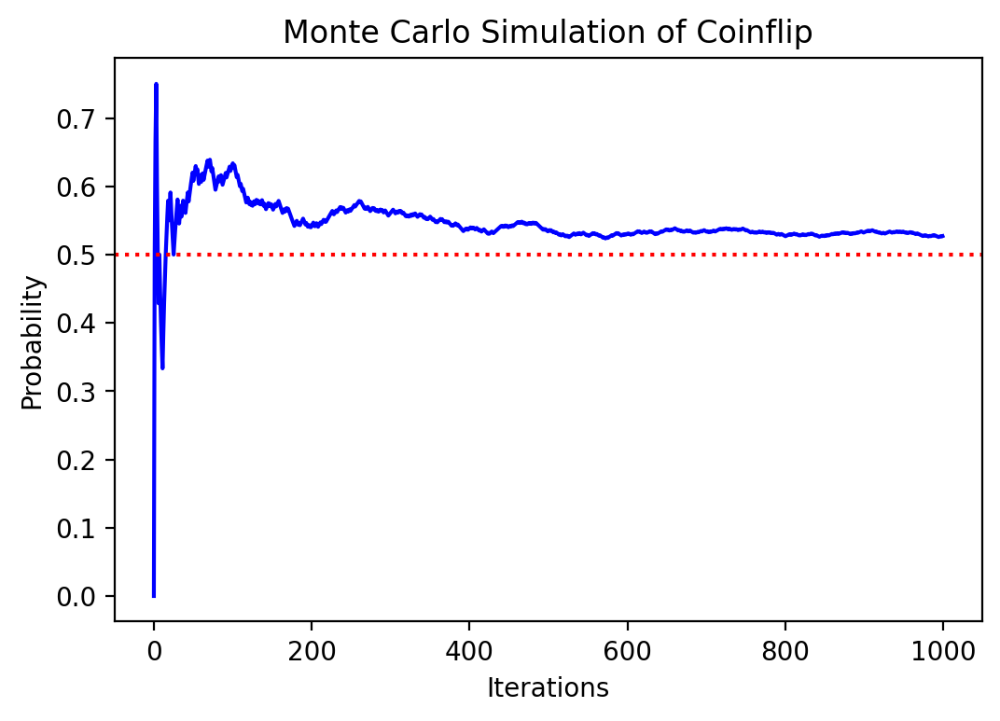
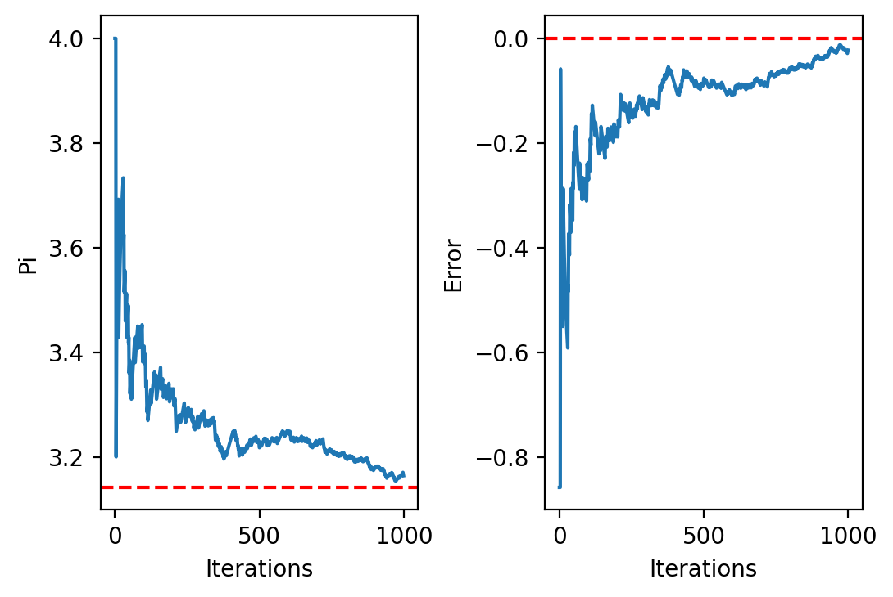
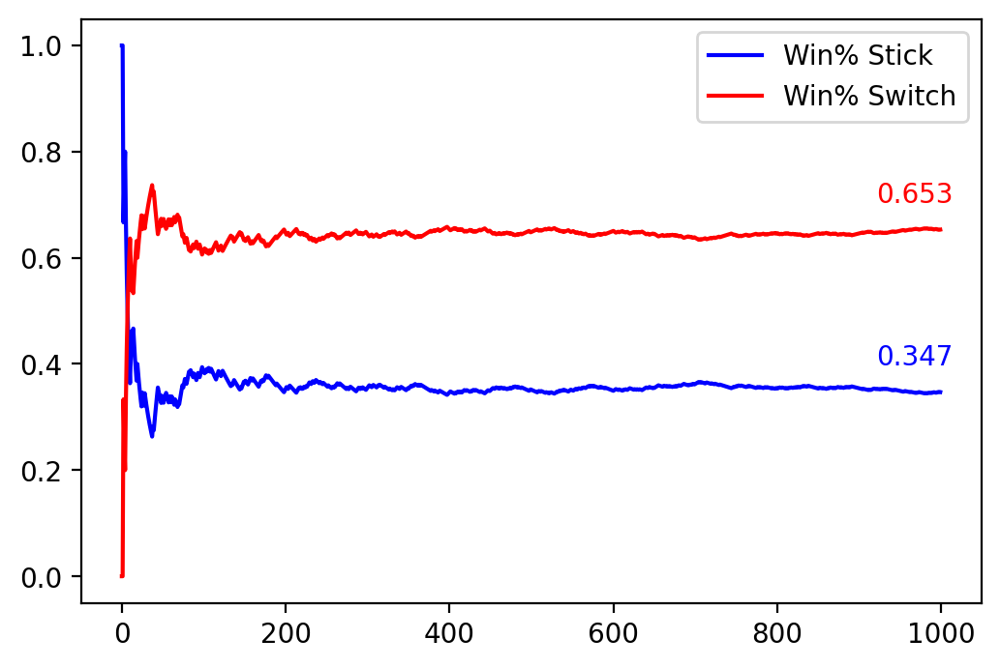

Examples from [Towards AI](https://medium.com/towards-artificial-intelligence/monte-carlo-simulation-an-in-depth-tutorial-with-python-bcf6eb7856c8)

# Coinflip Example
Use random sampling to determine the probability of flipping heads

### Python modules needed to perform simulations


```python
import random
import numpy as np
import matplotlib.pyplot as plt
import turtle
import math
```

### Coinflip function
Here we create a function that will return, at random, a 0 or 1 that we can call to simulate a coinflip.


```python
def coinFlip():
    return random.randint(0,1) #random discrete variable 0 or 1
```

## Monte Carlo Simulation

### Monte Carlo function
We define the monte carlo function for an input n to run the coinflip n times and return a list of probabilites calculated from the simulation. The simulation calculates an estimated probability at each iteration by dividing the number of heads (1's) represented by `results` by the total number of coinflips, which is `i+1`.


```python
def monteCarlo(n):
    probabilities = []
    heads = 0
    for i in range(n):
        flip_result = coinFlip() #returns 0 or 1
        heads += flip_result
        prob_value = heads/(i+1) #gives the number of 1's divided by the number of flips
        probabilities.append(prob_value)
    return probabilities
```

Here we use matplotlib, to plot the probabilities we measured for each iteration compared with the actual known probability of flipping heads.


```python
#plotting results
results = monteCarlo(1000)
plt.figure(dpi=200)
plt.plot(results,color='b',linestyle='-')
plt.axhline(y=0.5,color='r',linestyle='dotted')
plt.xlabel("Iterations")
plt.ylabel("Probability")
plt.title("Monte Carlo Simulation of Coinflip")
plt.show()
```


    

    


# Estimating Pi

To estimate $\pi$ we will utilize the geometry of a circle inscribed in a square. The area of the square will be equal to $4r^2$ because the side length is $2r$ and the area of the circle is $\pi r^2$. So, $\frac{A_{\text{square}}}{A_{\text{circle}}} = \frac{4}{\pi}$. To estimate this ratio and thus estimate pi we can use the Monte Carlo method with the Turtle module for Python.

## Plotting Shapes

We define the radius to be 100 and draw a square using twice that radius as the side lengths centered at 0,0. We then use Turtles built in circle function in the line `myPen.circle(r)` to produce a circle with radius r. 


```python
myPen = turtle.Turtle()
myPen.hideturtle()
myPen.speed(0)
r = 100 #radius of circle (and half side length of square because circle inscribed)

#Square with side length 2*r
myPen.up()
myPen.setposition(-r,-r)
myPen.down()
myPen.fd(2*r)
myPen.left(90)
myPen.fd(2*r)
myPen.left(90)
myPen.fd(2*r)
myPen.left(90)
myPen.fd(2*r)
myPen.left(90)

#Cirlce with radius, r
myPen.up()
myPen.setposition(0,-r)
myPen.down()
myPen.circle(r)

```

## Main Function

To estimate the ratio of the area of the circles we randomly choose points within the square. If that point is more than 1 radius away from the center of the circle, as determined by the line `if(x**2+y**2>r**2)` then it is classified as outside of the circle. From these points in and outside the circle we would estimate that the relative ratio of the square area to the circle area is $\approx$ all of the point divided by the points inside the circle. And because this ratio should be equal to $\frac{4}{\pi}$ we can derive our estimate for by using the following code:
```
square_area_estimate = in_circle+out_circle
circle_area_estimate = in_circle
pi = 4.0 * circle_area_estimate / square_area_estimate
```


```python
def monteCarlo(n):
    in_circle = 0
    out_circle = 0
    pi_values,error = [],[]
    for i in range(n):
        #generating random coordinate point inside square
        x = random.randrange(-r,r)
        y = random.randrange(-r,r)

        #if less than radius away from center --> is in circle --> plot black point
        if(x**2+y**2>r**2):
            myPen.color("black")
            myPen.up()
            myPen.goto(x,y)
            myPen.down()
            myPen.dot()
            out_circle += 1
        
        #else plot red point
        else:
            myPen.color("red")
            myPen.up()
            myPen.goto(x,y)
            myPen.down()
            myPen.dot()
            in_circle += 1

        #deriving value of pi from area estimates
        square_area_estimate = in_circle+out_circle
        circle_area_estimate = in_circle
        pi = 4.0 * circle_area_estimate / square_area_estimate
        pi_values.append(pi)

        #calculating difference between estimate and actual value
        error.append(math.pi - pi)

    return {
        'pi_values':pi_values,
        'error':error
           }
            

```


```python
results = monteCarlo(1000)
```

We plot these results over the iterations of the simulation we run and also plot our error, or the difference between the results and $\pi$


```python
#plotting results

fig, (ax1, ax2) = plt.subplots(1, 2)
fig.dpi = 200
ax1.axhline(y=math.pi,color='red',linestyle='dashed')
ax1.plot(results['pi_values'])
ax1.set_xlabel('Iterations')
ax1.set_ylabel('Pi')
ax2.axhline(y=0,color='red',linestyle='dashed')
ax2.plot(results['error'])
ax2.set_xlabel('Iterations')
ax2.set_ylabel('Error')
plt.subplots_adjust(wspace = 0.4)
plt.show()
```


    

    


# Monty Hall Problem

A classic problem in statistics that can be solved using the Monte Carlo method is the Monty Hall Problem. In this problem the premise is that you get a choice between three doors and one holds a prize. After the choice one of the other ones containing nothing will be opened so two doors will be left. You will then be asked whether to switch or stick with what you chose. We can implement this with code by creating a list representing the doors: `doors = ['failure','failure','success']`. The selection of your door can be represented with a random choice between 0 and 2, the indices of the list. If this choice was correct then sticking would result in a win. If this choice was not correct, then switching would result in a win. So, we can compute the total number of switch wins and stick wins and divide by the total number of attempts to estimate the probability.  


```python
def monteCarlo(n):
    doors = ['failure','failure','success']
    switch_probs, stick_probs = [],[]

    switch_wins, stick_wins = 0,0 #wins with each strategy
    for i in range(n):
        random.shuffle(doors) 
        choice = random.randint(0,2) #randomly choose from doors
        
        if doors[choice] != 'success':
            switch_wins += 1 #if choice was wrong then switch on next move wins
        else:
            stick_wins += 1 #if choice was right then stick on next move wins
        
        rounds = i + 1
        switch_probs.append(switch_wins/rounds)
        stick_probs.append(stick_wins/rounds)
    
    return {
        'stick_probs':stick_probs,
        'switch_probs':switch_probs
           }
```


```python
results = monteCarlo(1000)
switch_probs = results['switch_probs']
stick_probs = results['stick_probs']
```


```python
#plotting results
plt.figure(dpi=200)
plt.plot(stick_probs,'blue',label='Win% Stick')
plt.plot(switch_probs,'red',label='Win% Switch')
plt.legend()
plt.annotate(str(stick_probs[-1]),(1000,stick_probs[-1]),textcoords="offset points",xytext=(-10,10), ha='center',color='blue')
plt.annotate(str(switch_probs[-1]),(1000,switch_probs[-1]),textcoords="offset points",xytext=(-10,10), ha='center',color='red')
```


    Text(-10, 10, '0.653')


    

    

